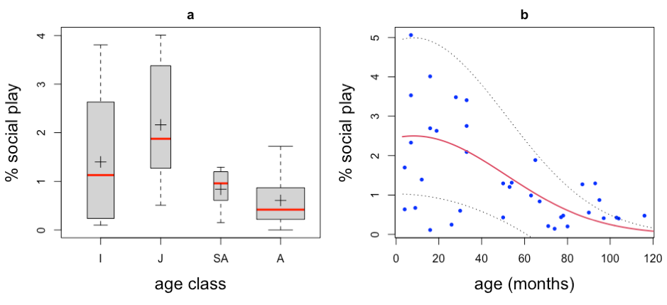

# social play in adult howler monkeys

    

<h5>

  R scripts and databases used to study social play in adult howler monkeys for the study 'Socioecological correlates of social play in adult howler monkeys (<i>Alouatta palliata mexicana<i/> and <i>A. p. palliata<i/>)'
  
  </h5>

<b>Figure 1.</b> (a) Changes in social play in howler monkeys according to age class (I: immatures, J: Juveniles, SA: subadults, A: adults). The boundary of the box closest to 0 indicates the 25th percentile, a solid line and cross within the box marks the median and mean, respectively, and the boundary of the box farthest from zero indicates the 75th percentile. (b) Relationship between age (months) and social play; 95% confidence intervals are shown in grey dotted lines around the solid regression line.
    
    
